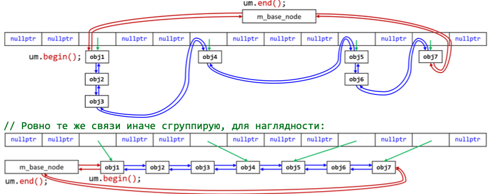

# Unordered map
## realisation
+ **Хэш-таблица, реализованная методом цепочек**
```c++
std::pair<iterator, bool> insert(const Key& key);
/* вычисляет хэш-функцию h(key), ищет в списке элемент
1)если существует: <it, false>		2)если нет: <it, true> */

size_t erase(const Key& key);
/* ищет - удаляет -> число удаленных элементов (0, 1)  */ 

iterator find(const Key& key);
/* вычисляет хэш-функцию h(key), ищет в списке элемент -> end() - не найден
```
есть реализации, принимающие итераторы 
## iterators 
Как связаны элементы структуры между собой, особенно, между разными хэшами:
+ `unordered_map = hash_table + list`



```c++
struct Node{
	Node* next; // указатель на следующий
	Node* prev; // указатель на предыдущий
	pair<const Key, Value> data; // данные узла 
	size_t cached_hash; // значение хэш-функции
};
```
+ хотя структура хранит двусвязный список, смысла поддерживать `bidirectional iterator` нет, так как ключи не упорядочены
## invalidation iterators 
+ только `insert` может инвалидировать итераторы, если произошел рехэш
+ `unordered_map` хранит некоторые параметры:
```c++
size_t bucket_count(); // число списков(размер хэш-массива)
float load_factor() const; // сколько в среднем элементов в одном списке
float max_load_factor() const; // константа: < load_factor -> rehash
``` 
+ `rehash` - перестраивает порядок элементов --> итераторы инвалидируются (`O(n^3)` в худшем)
+ указатели и ссылки не инвалидируются (элементы не пересоздаются)
+ `reserve` - помогает избежать рехэша

## template parameters
```c++
template<
    class Key,
    class Value,
    class Hash = std::hash<Key>, // функтор - хэш-функция
    class KeyEqual = std::equal_to<Key>, // компаратор на ==
    class Allocator = std::allocator< std::pa ir<const Key, T> >
> class unordered_map;
```
+ `std::hash<Key>` определен только для стнадартных типов, но  [его можно дописать до пользовательского](https://en.cppreference.com/w/cpp/utility/hash)
